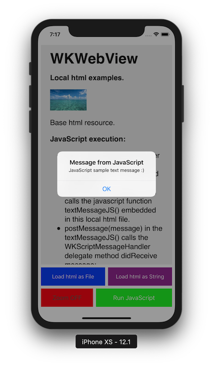

# WKWebViewLocalAssets

[The same Sample iOS app in Objective C.](https://github.com/vasilevkin/WKWebViewLocalAssetsObjC)

Sample iOS app demonstrating WKWebView loading local html file (with css style and images) and calling Javascript code.

Language: Swift 4.2.

### Html + css examples:

* Display local text
* Custom text fonts
* Custom text sizes
* Custom text and background colors
* Display local images
* Load local html web asset as file
* Load local html web asset as string
* External links
* Open links in Safari
* Compose and send email

### JavaScript examples:

* Wrapper for the WKWebView to allow usage in Interface Builder
* Add ScriptMessageHandler in JavaScript
* Callback from JavaScript
* evaluateJavaScript errors handling
* Disable / enable magnification gesture and zoom changes

### Related blog posts:
[Displaying large blocks of text in Swift](https://svasilevkin.wordpress.com/2019/03/03/displaying-large-blocks-of-text-in-swift/)

[WKWebView disable magnification gesture and zoom changes](https://svasilevkin.wordpress.com/2019/03/03/wkwebview-disable-magnification-gesture-and-zoom-changes/)

[WKWebView open links in a Safari](https://svasilevkin.wordpress.com/2019/03/08/wkwebview-open-links-in-a-safari/)

[WKWebView, How to send an email](https://svasilevkin.wordpress.com/2019/03/08/wkwebview-how-to-send-an-email/)

## Author

Sergey Vasilevkin - [Contact me](https://svasilevkin.wordpress.com/contact-me/)

My blog
[Passionate Mobile Development](https://svasilevkin.wordpress.com/blog/)

## License

This project is licensed under the MIT License - see the [LICENSE](LICENSE) file for details